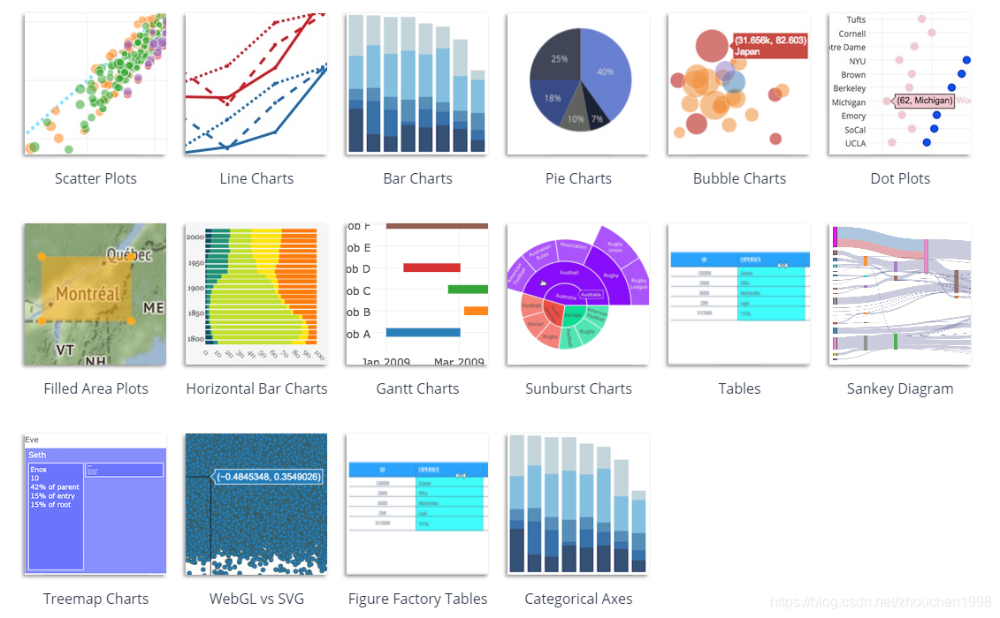
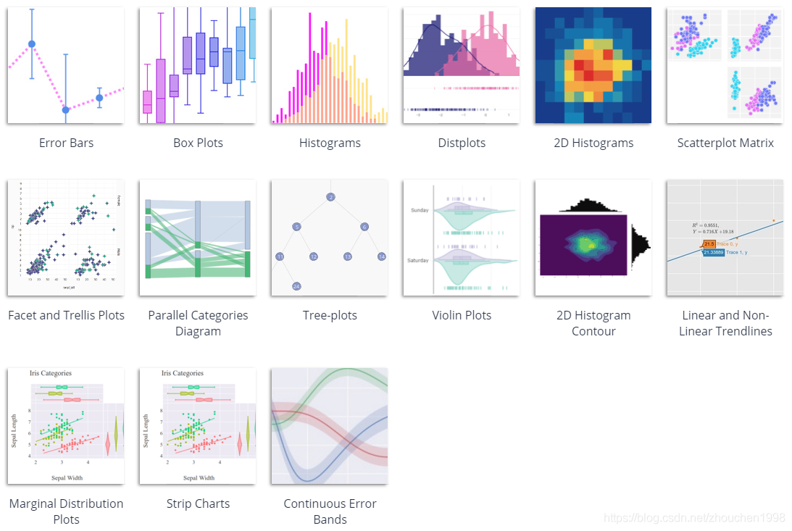

# Plotly

## Overview
**Plotly**是一个非常强大的开源交互式可视化框架，它通过构建基于 HTML 的交互式图表来显示信息，可创建各种形式的精美图表。Plotly提供了Python，R，Matlab等多种语言API，因此我们可以很方便地在这些软件中调用Plotly，从而快速实现交互式的可视化绘图。





## Plotly Pipeline
使用plotly-R包制作的图形是由JavaScript库[plotly.js](https://github.com/plotly/plotly.js)提供底层支持。plotly-R包中的核心函数是`plot_ly()`，它连接了R与js。我们首先来尝试使用`plot_ly()`探索ggplot2中的diamonds数据集，了解如何使用plotly工作。

### visualization demo
```{r}
# load packages
library(plotly)
library(dplyr)
library(htmlwidgets)
library(htmltools)

# load the diamonds dataset from the ggplot2 package
data(diamonds, package = "ggplot2")
diamonds
```

```{r}
plot_ly(diamonds, x = ~cut)
plot_ly(diamonds, x = ~cut, y = ~clarity)
plot_ly(diamonds, x = ~cut, color = ~clarity, colors = "Accent")
```
### easy to add trace
```{r}
p <- diamonds %>%
  plot_ly(x = ~cut) %>% 
  add_histogram(name = "hist") %>%
  group_by(cut) %>%
  summarise(n = n()) %>%
  add_text(
    text = ~scales::comma(n), y = ~n, 
    textposition = "top middle", 
    cliponaxis = FALSE,
    name = "text"
  ) %>%
  ungroup() %>%
  mutate(avg = mean(n)) %>%
  add_lines(y = ~avg,     
            opacity = 0.8,
            line =list(width=2),
            name = "avg"
  ) 
p
```

### getting raw data

```{r}
p %>% plotly_data()
```

### publishing output

```{r}
saveWidget(p, "p.html", selfcontained = F, libdir = "lib")
```


## Plotly Foundations

正如我们在第2节中所看到的，一个plotly图像由多条trace组成，每种trace对应一个画图类型，例如，点、线、文本和多边形，与R base plot 和 ggplot2类似。这些trace通过`add_trace()`或`add_*()`函数（`add_markers(), add_lines(), add_paths(), add_segments(), add_ribbons(), add_area(), and add_polygons()`等）来创建。

### markers

```{r}
# load the mpg dataset from the ggplot2 package
data(mpg, package = "ggplot2")
mpg
```

#### Alpha
```{r}
plot_ly(mpg, x = ~cty, y = ~hwy)  %>% 
    add_markers(alpha = 0.3)
```

#### Colors

***discrete***
```{r}
plot_ly(mpg, x = ~cty, y = ~hwy) %>%
  add_markers(color = ~factor(cyl))
```

***continuous***
```{r}
plot_ly(mpg, x = ~cty, y = ~hwy) %>%
  add_markers(color = ~cyl) %>% 
    colorbar()
```

***no mapping data values***
```{r}
plot_ly(mpg, x = ~cty, y = ~hwy) %>%
  add_markers(color = I("black"))
```

#### Symbols
```{r}
plot_ly(mpg, x = ~cty, y = ~hwy) %>%
  add_markers(symbol = ~factor(cyl))
```

#### Size
```{r}
plot_ly(mpg, x = ~cty, y = ~hwy, alpha = 0.3)  %>%
  add_markers(size = ~cyl)
```

###  Lines

```{r}
# load the txhousing dataset from the ggplot2 package
data(txhousing, package = "ggplot2")
txhousing
```

#### Linetypes

```{r}
top5 <- txhousing %>%
  group_by(city) %>%
  summarise(avg = mean(sales, na.rm = TRUE)) %>%
  arrange(desc(avg)) %>%
  top_n(5)

tx5 <- semi_join(txhousing, top5, by = "city")

plot_ly(tx5, x = ~date, y = ~median) %>%
  add_lines(linetype = ~city)
```

### Bars & histograms
```{r}
p1 <- plot_ly(diamonds, x = ~price) %>%
  add_histogram()
p2 <- plot_ly(diamonds, x = ~cut) %>%
  add_histogram()
subplot(p1, p2) %>% hide_legend()
```

***Multiple numeric distributions***
```{r}
one_plot <- function(d) {
  plot_ly(d, x = ~price) %>%
    add_histogram() %>%
    add_annotations(
      ~unique(clarity), x = 0.5, y = 1, 
      xref = "paper", yref = "paper", showarrow = FALSE
    )
}

diamonds %>%
  split(.$clarity) %>%
  lapply(one_plot) %>% 
  subplot(nrows = 2, shareX = TRUE, titleX = FALSE) %>%
  hide_legend()
```

***Multiple discrete distributions***
```{r}
plot_ly(diamonds, x = ~cut, color = ~clarity) %>%
  add_histogram()
```

***percent***
```{r}
# number of diamonds by cut and clarity (n)
cc <- count(diamonds, cut, clarity)
# number of diamonds by cut (nn)
cc2 <- left_join(cc, count(cc, cut, wt = n, name = 'nn'))
cc2 %>%
  mutate(prop = n / nn) %>%
  plot_ly(x = ~cut, y = ~prop, color = ~clarity) %>%
  add_bars() %>%
  layout(barmode = "stack")
```

### Boxplots
```{r}
p <- plot_ly(diamonds, y = ~price, color = I("black"), 
             alpha = 0.1, boxpoints = "suspectedoutliers")
p1 <- p %>% add_boxplot(x = "Overall")
p2 <- p %>% add_boxplot(x = ~cut)
subplot(
  p1, p2, shareY = TRUE,
  widths = c(0.2, 0.8), margin = 0
) %>% hide_legend()
```

```{r}
d <- diamonds %>%
  mutate(cc = interaction(clarity, cut))

# interaction levels sorted by median price
lvls <- d %>%
  group_by(cc) %>%
  summarise(m = median(price)) %>%
  arrange(m) %>%
  pull(cc)

plot_ly(d, x = ~price, y = ~factor(cc, lvls)) %>%
  add_boxplot(color = ~clarity) %>%
  layout(yaxis = list(title = ""))
```

## Plotly Advanced

### ggplotly
```{r echo=FALSE}
library(ggthemr)

palette <- c(
  "flat", "flat dark", "dust", "light", "earth",
  "fresh", "chalk", "lilac", "carrot", "pale",
  "copper", "grape", "greyscale", "sky", "solarized", "grass", "sea", "camouflage"
)

get_ggthemr_color <- function(palette = "flat", return_type = "fill"){
  color <- as.vector(ggthemr(palette, set_theme = FALSE)$palette$swatch)
  if (return_type == "values")
    return(color)
  if (return_type == "fill")
    return(scale_fill_manual(values = color))
  if (return_type == "color")
    return(scale_color_manual(values = color))
}
```

```{r}
data("iris")

one_ggplot <- function(i = 1){
  themr <- ggthemr(palette[i], set_theme = FALSE)
  p <- iris %>%
    ggplot(aes(Sepal.Length, fill = Species)) +
    geom_histogram(binwidth = 0.2) +
    get_ggthemr_color(palette = palette[i], return_type = "fill") +
    themr$theme
  return(p)
}

one_ggplot()

one_ggplot() %>%
  ggplotly()
```

### layout
```{r}
title_font <- list(color = "white", size = 26, family = "Microsoft YaHei")
axis_font <- list(color = "white", size = 20, family = "Microsoft YaHei")

plot_ly(mpg, x = ~cty, y = ~hwy) %>%
  add_markers(color = ~factor(cyl)) %>%
  layout(
    title = list(
      text = paste('markers-dark-theme'),
      font = title_font
    ),
    showlegend = TRUE,
    legend = list(font = list(color = 'white')),
    yaxis = list(
      tickmode='array',
      autorange = TRUE,
      showgrid = FALSE,
      title = list(text = 'cty') ,
      showline = TRUE,
      color = 'white',
      font = axis_font,
      nticks = 4
    ),
    xaxis = list(
      showline = TRUE,
      title = list(text = 'hwy'),
      color = 'white',
      font = axis_font
    ),
    paper_bgcolor = "#000000",
    plot_bgcolor = "#000000",
    margin = list(
      t = 90,
      b = 90,
      l = 90,
      r = 90
    )
  )
```

### Javascript
`plotly_hover`, `plotly_click`, `plotly_selected`

***example 1***
```{r}
p <- plot_ly(mtcars, x = ~wt, y = ~mpg) %>%
  add_markers(
    text = rownames(mtcars),
    customdata = paste0("https://www.bing.com/search?q=", rownames(mtcars))
  )
  
onRender(
  p, "
  function(el) {
    el.on('plotly_click', function(d) {
      var url = d.points[0].customdata;
      window.open(url);
    });
  }
")

```

<strong>Click 👆</strong>

***example 2***
```{r}
nms <- names(mtcars)

p <- plot_ly(colors = "RdBu") %>%
  add_heatmap(
    x = nms, 
    y = nms, 
    z = ~round(cor(mtcars), 3)
  ) %>%
  onRender("
    function(el) {
      Plotly.d3.json('mtcars.json', function(mtcars) {
        el.on('plotly_click', function(d) {
          var x = d.points[0].x;
          var y = d.points[0].y;
          var trace = {
            x: mtcars[x],
            y: mtcars[y],
            mode: 'markers'
          };
          Plotly.newPlot('filtered-plot', [trace]);
        });
      });
    }
")

# In a temporary directory, save the mtcars dataset as json and
# the html to an test.html file, then open via a web server
withr::with_path(tempdir(), {
  jsonlite::write_json(as.list(mtcars), "mtcars.json")
  html <- tagList(p, tags$div(id = 'filtered-plot'))
  save_html(html, "mtcars.html")
  # if (interactive()) servr::httd()
})
```

```{r eval=FALSE, include=FALSE}
library(plotly)
library(htmltools)

nms <- names(mtcars)

p <- plot_ly(colors = "RdBu") %>%
  add_heatmap(
    x = nms, 
    y = nms, 
    z = ~round(cor(mtcars), 3)
  ) %>%
  onRender("
    function(el) {
      var mtcars = {'mpg':[21,21,22.8,21.4,18.7,18.1,14.3,24.4,22.8,19.2,17.8,16.4,17.3,15.2,10.4,10.4,14.7,32.4,30.4,33.9,21.5,15.5,15.2,13.3,19.2,27.3,26,30.4,15.8,19.7,15,21.4],'cyl':[6,6,4,6,8,6,8,4,4,6,6,8,8,8,8,8,8,4,4,4,4,8,8,8,8,4,4,4,8,6,8,4],'disp':[160,160,108,258,360,225,360,146.7,140.8,167.6,167.6,275.8,275.8,275.8,472,460,440,78.7,75.7,71.1,120.1,318,304,350,400,79,120.3,95.1,351,145,301,121],'hp':[110,110,93,110,175,105,245,62,95,123,123,180,180,180,205,215,230,66,52,65,97,150,150,245,175,66,91,113,264,175,335,109],'drat':[3.9,3.9,3.85,3.08,3.15,2.76,3.21,3.69,3.92,3.92,3.92,3.07,3.07,3.07,2.93,3,3.23,4.08,4.93,4.22,3.7,2.76,3.15,3.73,3.08,4.08,4.43,3.77,4.22,3.62,3.54,4.11],'wt':[2.62,2.875,2.32,3.215,3.44,3.46,3.57,3.19,3.15,3.44,3.44,4.07,3.73,3.78,5.25,5.424,5.345,2.2,1.615,1.835,2.465,3.52,3.435,3.84,3.845,1.935,2.14,1.513,3.17,2.77,3.57,2.78],'qsec':[16.46,17.02,18.61,19.44,17.02,20.22,15.84,20,22.9,18.3,18.9,17.4,17.6,18,17.98,17.82,17.42,19.47,18.52,19.9,20.01,16.87,17.3,15.41,17.05,18.9,16.7,16.9,14.5,15.5,14.6,18.6],'vs':[0,0,1,1,0,1,0,1,1,1,1,0,0,0,0,0,0,1,1,1,1,0,0,0,0,1,0,1,0,0,0,1],'am':[1,1,1,0,0,0,0,0,0,0,0,0,0,0,0,0,0,1,1,1,0,0,0,0,0,1,1,1,1,1,1,1],'gear':[4,4,4,3,3,3,3,4,4,4,4,3,3,3,3,3,3,4,4,4,3,3,3,3,3,4,5,5,5,5,5,4],'carb':[4,4,1,1,2,1,4,2,2,4,4,3,3,3,4,4,4,1,2,1,1,2,2,4,2,1,2,2,4,6,8,2]};

      el.on('plotly_click', function(d) {
            var x = d.points[0].x;
            var y = d.points[0].y;
            var trace = {
              x: mtcars[x],
              y: mtcars[y],
              mode: 'markers'
            };
            Plotly.newPlot('filtered-plot', [trace]);
          });
    }
")

#   onRender("
#     function(el) {
#       Plotly.d3.json('mtcars.json', function(mtcars) {
#         el.on('plotly_click', function(d) {
#           var x = d.points[0].x;
#           var y = d.points[0].y;
#           var trace = {
#             x: mtcars[x],
#             y: mtcars[y],
#             mode: 'markers'
#           };
#           Plotly.newPlot('filtered-plot', [trace]);
#         });
#       });
#     }
# ")


# In a temporary directory, save the mtcars dataset as json and
# the html to an test.html file, then open via a web server
withr::with_path(tempdir(), {
  jsonlite::write_json(as.list(mtcars), "mtcars.json")
  html <- tagList(p, tags$div(id = 'filtered-plot'))
  save_html(html, "mtcars.html")
  # if (interactive()) servr::httd()
})
```

<strong>Click 👇</strong>

```{=html}
<script src="lib/htmlwidgets-1.5.4/htmlwidgets.js"></script>
<script src="lib/plotly-binding-4.10.0/plotly.js"></script>
<script src="lib/typedarray-0.1/typedarray.min.js"></script>
<script src="lib/jquery-3.5.1/jquery.min.js"></script>
<link href="lib/crosstalk-1.2.0/css/crosstalk.min.css" rel="stylesheet" />
<script src="lib/crosstalk-1.2.0/js/crosstalk.min.js"></script>
<link href="lib/plotly-htmlwidgets-css-2.5.1/plotly-htmlwidgets.css" rel="stylesheet" />
<script src="lib/plotly-main-2.5.1/plotly-latest.min.js"></script>

<div id="htmlwidget-mtcars" style="height:400px;" class="plotly html-widget"></div>
<script type="application/json" data-for="htmlwidget-mtcars">{"x":{"visdat":{"ab5f3c0f3b58":["function () ","plotlyVisDat"]},"cur_data":"ab5f3c0f3b58","attrs":{"ab5f3c0f3b58":{"colors":"RdBu","alpha_stroke":1,"sizes":[10,100],"spans":[1,20],"z":{},"x":["mpg","cyl","disp","hp","drat","wt","qsec","vs","am","gear","carb"],"y":["mpg","cyl","disp","hp","drat","wt","qsec","vs","am","gear","carb"],"type":"heatmap","inherit":true}},"layout":{"margin":{"b":40,"l":60,"t":25,"r":10},"xaxis":{"domain":[0,1],"automargin":true,"title":[]},"yaxis":{"domain":[0,1],"automargin":true,"title":[]},"scene":{"zaxis":{"title":"round(cor(mtcars), 3)"}},"hovermode":"closest","showlegend":false,"legend":{"yanchor":"top","y":0.5}},"source":"A","config":{"modeBarButtonsToAdd":["hoverclosest","hovercompare"],"showSendToCloud":false},"data":[{"colorbar":{"title":"round(cor(mtcars), 3)","ticklen":2,"len":0.5,"lenmode":"fraction","y":1,"yanchor":"top"},"colorscale":[["0","rgba(103,0,31,1)"],["0.0416666666666667","rgba(133,8,36,1)"],["0.0833333333333333","rgba(165,20,41,1)"],["0.125","rgba(187,47,51,1)"],["0.166666666666667","rgba(202,76,65,1)"],["0.208333333333333","rgba(217,102,81,1)"],["0.25","rgba(230,131,103,1)"],["0.291666666666667","rgba(242,159,125,1)"],["0.333333333333333","rgba(248,183,153,1)"],["0.375","rgba(252,205,181,1)"],["0.416666666666667","rgba(252,224,207,1)"],["0.458333333333333","rgba(250,235,227,1)"],["0.5","rgba(247,247,247,1)"],["0.541666666666667","rgba(231,239,244,1)"],["0.583333333333333","rgba(215,232,241,1)"],["0.625","rgba(194,221,236,1)"],["0.666666666666667","rgba(168,208,228,1)"],["0.708333333333333","rgba(140,193,220,1)"],["0.75","rgba(110,172,209,1)"],["0.791666666666667","rgba(75,151,197,1)"],["0.833333333333333","rgba(57,132,187,1)"],["0.875","rgba(43,113,178,1)"],["0.916666666666667","rgba(28,93,159,1)"],["0.958333333333333","rgba(17,70,127,1)"],["1","rgba(5,48,97,1)"]],"showscale":true,"z":[[1,-0.852,-0.848,-0.776,0.681,-0.868,0.419,0.664,0.6,0.48,-0.551],[-0.852,1,0.902,0.832,-0.7,0.782,-0.591,-0.811,-0.523,-0.493,0.527],[-0.848,0.902,1,0.791,-0.71,0.888,-0.434,-0.71,-0.591,-0.556,0.395],[-0.776,0.832,0.791,1,-0.449,0.659,-0.708,-0.723,-0.243,-0.126,0.75],[0.681,-0.7,-0.71,-0.449,1,-0.712,0.091,0.44,0.713,0.7,-0.091],[-0.868,0.782,0.888,0.659,-0.712,1,-0.175,-0.555,-0.692,-0.583,0.428],[0.419,-0.591,-0.434,-0.708,0.091,-0.175,1,0.745,-0.23,-0.213,-0.656],[0.664,-0.811,-0.71,-0.723,0.44,-0.555,0.745,1,0.168,0.206,-0.57],[0.6,-0.523,-0.591,-0.243,0.713,-0.692,-0.23,0.168,1,0.794,0.058],[0.48,-0.493,-0.556,-0.126,0.7,-0.583,-0.213,0.206,0.794,1,0.274],[-0.551,0.527,0.395,0.75,-0.091,0.428,-0.656,-0.57,0.058,0.274,1]],"x":["mpg","cyl","disp","hp","drat","wt","qsec","vs","am","gear","carb"],"y":["mpg","cyl","disp","hp","drat","wt","qsec","vs","am","gear","carb"],"type":"heatmap","xaxis":"x","yaxis":"y","frame":null}],"highlight":{"on":"plotly_click","persistent":false,"dynamic":false,"selectize":false,"opacityDim":0.2,"selected":{"opacity":1},"debounce":0},"shinyEvents":["plotly_hover","plotly_click","plotly_selected","plotly_relayout","plotly_brushed","plotly_brushing","plotly_clickannotation","plotly_doubleclick","plotly_deselect","plotly_afterplot","plotly_sunburstclick"],"base_url":"https://plot.ly"},"evals":[],"jsHooks":{"render":[{"code":"\n    function(el) {\n      var mtcars = {'mpg':[21,21,22.8,21.4,18.7,18.1,14.3,24.4,22.8,19.2,17.8,16.4,17.3,15.2,10.4,10.4,14.7,32.4,30.4,33.9,21.5,15.5,15.2,13.3,19.2,27.3,26,30.4,15.8,19.7,15,21.4],'cyl':[6,6,4,6,8,6,8,4,4,6,6,8,8,8,8,8,8,4,4,4,4,8,8,8,8,4,4,4,8,6,8,4],'disp':[160,160,108,258,360,225,360,146.7,140.8,167.6,167.6,275.8,275.8,275.8,472,460,440,78.7,75.7,71.1,120.1,318,304,350,400,79,120.3,95.1,351,145,301,121],'hp':[110,110,93,110,175,105,245,62,95,123,123,180,180,180,205,215,230,66,52,65,97,150,150,245,175,66,91,113,264,175,335,109],'drat':[3.9,3.9,3.85,3.08,3.15,2.76,3.21,3.69,3.92,3.92,3.92,3.07,3.07,3.07,2.93,3,3.23,4.08,4.93,4.22,3.7,2.76,3.15,3.73,3.08,4.08,4.43,3.77,4.22,3.62,3.54,4.11],'wt':[2.62,2.875,2.32,3.215,3.44,3.46,3.57,3.19,3.15,3.44,3.44,4.07,3.73,3.78,5.25,5.424,5.345,2.2,1.615,1.835,2.465,3.52,3.435,3.84,3.845,1.935,2.14,1.513,3.17,2.77,3.57,2.78],'qsec':[16.46,17.02,18.61,19.44,17.02,20.22,15.84,20,22.9,18.3,18.9,17.4,17.6,18,17.98,17.82,17.42,19.47,18.52,19.9,20.01,16.87,17.3,15.41,17.05,18.9,16.7,16.9,14.5,15.5,14.6,18.6],'vs':[0,0,1,1,0,1,0,1,1,1,1,0,0,0,0,0,0,1,1,1,1,0,0,0,0,1,0,1,0,0,0,1],'am':[1,1,1,0,0,0,0,0,0,0,0,0,0,0,0,0,0,1,1,1,0,0,0,0,0,1,1,1,1,1,1,1],'gear':[4,4,4,3,3,3,3,4,4,4,4,3,3,3,3,3,3,4,4,4,3,3,3,3,3,4,5,5,5,5,5,4],'carb':[4,4,1,1,2,1,4,2,2,4,4,3,3,3,4,4,4,1,2,1,1,2,2,4,2,1,2,2,4,6,8,2]};\n\n      el.on('plotly_click', function(d) {\n            var x = d.points[0].x;\n            var y = d.points[0].y;\n            var trace = {\n              x: mtcars[x],\n              y: mtcars[y],\n              mode: 'markers'\n            };\n            Plotly.newPlot('filtered-plot', [trace]);\n          });\n    }\n","data":null}]}}</script>
<div id="filtered-plot"></div>
```
