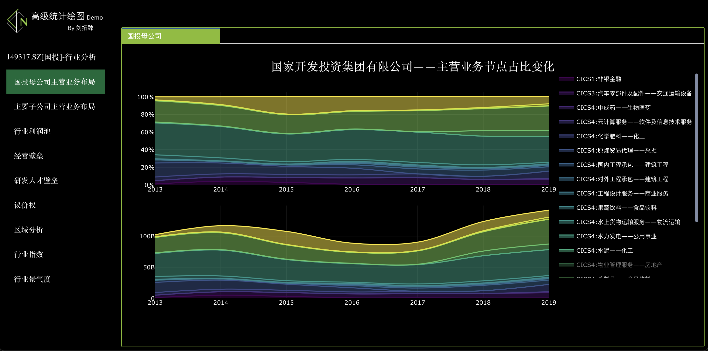

# Visualization Project

## Industry analysis

国家开发投资集团有限公司（简称"国投"）成立于1995年，是中央直接管理的国有重要骨干企业，是中央企业中唯一的投资控股公司，是首批国有资本投资公司改革试点单位。国投注册资本338亿元，截至2020年末，集团资产总额6823亿元，员工约5万人。2020年集团实现营业总收入1531亿元，利润总额221亿元，连续17年在国务院国资委经营业绩考核中荣获A级，连续五个任期获得业绩优秀企业。

国投成立以来，始终秉承资产经营与资本经营相结合的经营理念，坚持战略投资、价值投资，持续优化国有资本布局，提升产业竞争力，推动国有资本向关系国民经济命脉和国计民生的重要行业和关键领域集中，向战略性新兴产业集中，推动投资企业高质量发展，实现国有资本保值增值。

国投规划用三个五年的时间，建成具有全球竞争力的世界一流资本投资公司。到2025年集团创立30周年时，集团综合实力、核心竞争力和可持续发展能力大幅提升，在战略性新兴产业细分领域培育若干头部企业，产业结构和布局更加科学合理，进入世界500强，从国内一流走向国际一流。

**项目核心任务：**通过交互式统计图表

-   展现国投已有业务布局

-   挖掘潜在投资行业价值

-   为投资经营者提供参考

------------------------------------------------------------------------

<strong>点击跳转 👇</strong>

